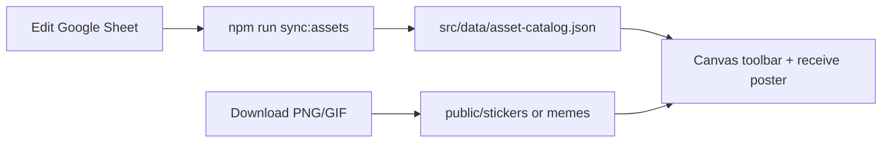

# PaperSorry Asset CMS

Google Sheet + local CSV catalog for **stickers** and **memes** only.

Your sheet: [PaperSorry assets](https://docs.google.com/spreadsheets/d/1rwY7G2854-tdSeCiqY40IgS_qeCOnLVuMYxmve3EwTg/edit)

---

## One-time: upgrade your Google Sheet

Replace your raw-link tabs with the structured templates from this repo.

### Step 1 — Two tabs only

| Tab name | Purpose |
|---|---|
| `Stickers` | Static sticker/icon assets (Flaticon, Icons8, Figma exports) |
| `Memes` | Animated GIF memes (Giphy) |

Delete or repurpose any old **Design refs** tab — it is not part of the CMS.

### Step 2 — Import CSV templates

For each tab:

1. Open the tab in Google Sheets
2. **File → Import → Upload**
3. Upload the matching file from `data/asset-cms/`:
   - `stickers.csv` → **Stickers** tab
   - `memes.csv` → **Memes** tab
4. Choose **Replace current sheet**

### Step 3 — Update tab IDs (after import)

If Google assigns new tab IDs, update `data/asset-cms/sheet.config.json`:

1. Open each tab — the URL contains `gid=XXXXXXXX`
2. Put that number in `sheet.config.json` under the matching tab

---

## Column reference (Stickers + Memes tabs)

| Column | Required | Example | Notes |
|---|---|---|---|
| `id` | yes | `bear-stickers` | Lowercase + hyphens. Never change after posters use it. |
| `label` | yes | `Sad bear` | Shown in toolbar tray |
| `category` | yes | `stickers` or `memes` | Maps to Figma `Tool/Stickers` vs `Tool/Memes` |
| `source_url` | yes | Flaticon/Giphy link | Your research/source link |
| `file` | when ready | `sad-bear.png` | Filename in `public/stickers/` or `public/memes/` |
| `attribution` | yes | `SoulGIE - Flaticon` | Required for licensed assets |
| `vibe` | optional | `funny` / `sweet` / `chaotic` | Filter by poster vibe later |
| `enabled` | yes | `TRUE` or `FALSE` | Only `TRUE` rows ship in the app |
| `notes` | optional | | Reminders for yourself |

---

## Workflow: sheet → app



### When you add or edit a row

1. Fill columns in Google Sheet (or edit local CSV)
2. Download asset file → `public/stickers/` or `public/memes/`
3. Set `file` column (e.g. `sad-bear.png`)
4. Set `enabled` to `TRUE`
5. Run sync:

```bash
npm run download:assets   # download GIFs/PNGs from sheet URLs + sync JSON
npm run sync:assets          # from local CSV only
npm run sync:assets:sheet    # pull from Google Sheet then sync
```

6. Tell your AI: *"Sticker catalog updated — wire canvas tray"*

---

## File locations

| Path | Role |
|---|---|
| `data/asset-cms/stickers.csv` | Sticker template + git backup |
| `data/asset-cms/memes.csv` | Meme template + git backup |
| `data/asset-cms/sheet.config.json` | Sheet ID + tab gids |
| `scripts/sync-asset-catalog.mjs` | CSV/Sheet → JSON |
| `scripts/download-asset-files.mjs` | Download Giphy GIFs + sticker PNGs into `public/` |
| `src/data/asset-catalog.json` | Generated — app reads this |
| `src/lib/asset-catalog.ts` | TypeScript helpers |
| `public/stickers/` | Static PNG/SVG files |
| `public/memes/` | GIF files |

---

## Licensing reminders

- **Flaticon free** — download + attribution required
- **Icons8** — check license per icon
- **Giphy** — review [Giphy API terms](https://developers.giphy.com/docs/api/terms/) before shipping memes
- Set `enabled` to `FALSE` until license + file are confirmed

---

## Enable your first asset (example)

1. Pick one Flaticon sticker → download as `beg-puppy.png`
2. Save to `public/stickers/beg-puppy.png`
3. In sheet row for `beg-icons`:
   - `file` = `beg-puppy.png`
   - `label` = `Beg puppy`
   - `enabled` = `TRUE`
4. `npm run sync:assets:sheet`
5. Asset appears in catalog as enabled
